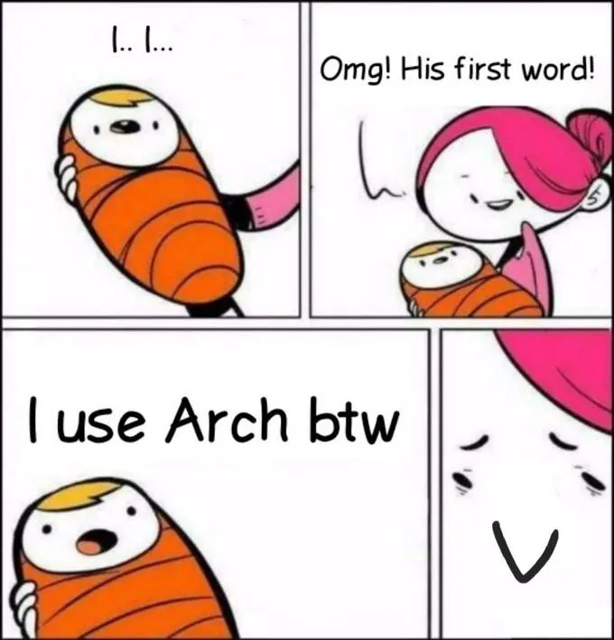
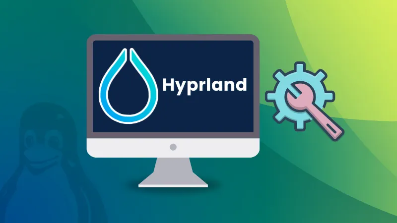
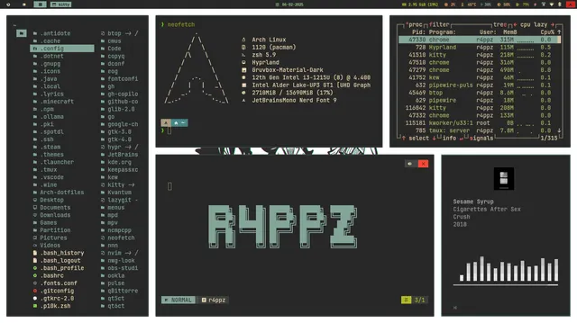
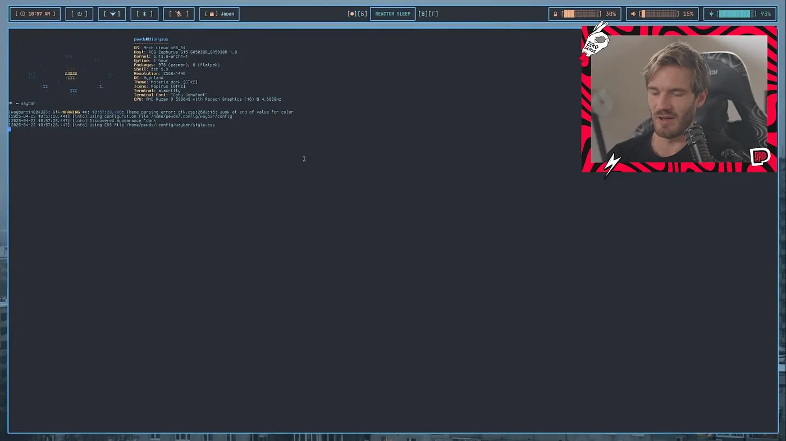
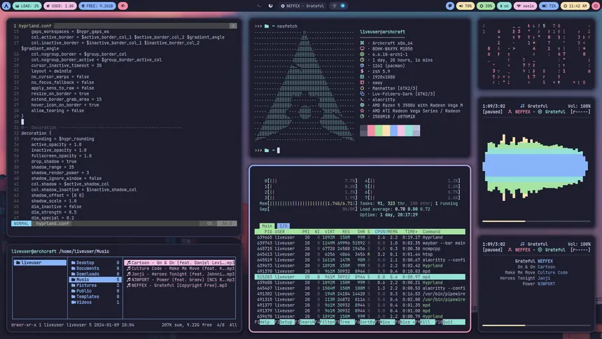
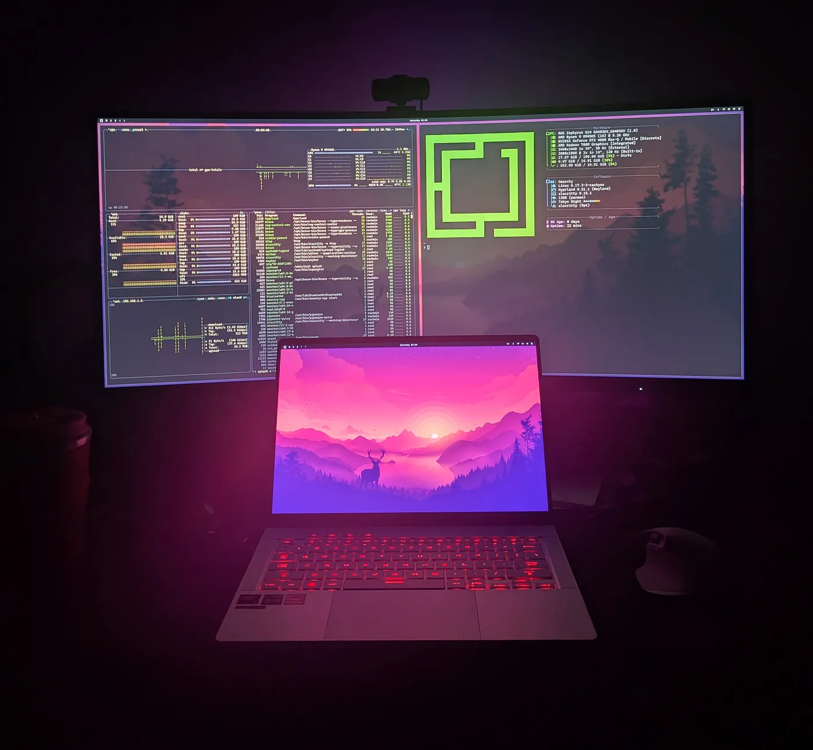

When a person choses Linux as their desktop operating system, they always face the paradox of choice. WHAT LINUX DISTRO TO USE ? There are literally thousands of different variations of distros (short for distribution) available, from low installation complexity, to very high installation complexity ( to the point that you only have a mere terminal after installation, but offering high customizability ). If we are talking about installation complexity and high customizability, the most prominent Linux distribution which is notorious for its complex installation procedure, and very high customizability is Arch Linux. It has been a popular fact among the linux community, to the point that in the past few years it has become a meme that if you are running Arch Linux, you have earned bragging rights, “I use Arch btw”

### Arch with Hyperland The beauty of tiling window managers

One of the many reasons people chose Arch linux, apart from its minimal nature, amzing community and rolling release model, has been the support of Hyperland, the tiling window manager. After installing stock Arch Linux, you have to chose ( or during installation with archinstall script ) a graphical user interface and a window managers. Where most linux distributions comes pre-packed with these, Arch gives you a choice. There are many options like Gnome ( used by Ubuntu ), Cinnamon ( used by Linux Mint ), KDE and so on. But while these come with floating-window managers, many developers has been praising and opting to use Tiling Window managers, like Hyperland.

### Tiling Window Managers

Tiling window managers is a linux window manager which automatically arranges application windows on the screen in a non overlapping way. Both Windows and MacOS and most Linux distros use floating window managers, where application windows are able to float on top of each other, or stack on top of each other. In contrast to that, tiling window managers automatically positions new application windows in a tile structure, automatically resized to fit in. Tiling window managers are keyboard-centric, meaning aligning windows, moving windows, arranging windows are all doable with a keyboard, which allows for very productive workflows for developers and other users.

Hyperland has been a very popular choice among Arch Linux users to create seemless, very productive setups

### One problem. Its just a window manager, not a fully fledged GUI

Now comes the hard part about using Hyperland on top of Arch Linux. As I was saying before, it is JUST A WINDOW MANAGER, NOT A GUI. So that means that you have to manually install the taskbar, notification system, wallpaper setter, application launcher and even the LOCK SCREEN. So its not easy at all, and could easily mess-up the installation, if you are not carefull enough.

And one more problem, there are several of choices for each of these components. There are lot of application launchers, file-managers, status-bars, notification-systems etc. So a user gets overwhelmed easily and spend many hours browsing through threads and searching for the optimal set of components. The paradox of choice strikes again. Even if you chose your commponents, there are many configurations you have to write manually as config files to set these up and get Hyperland + Arch setup to work seemlessly

### In comes Omarchy by dhh !

David Heinemeier Hansson, known as dhh in the developer community is the creator of Ruby on Rails and is a huge advocate of foss and open source software. Omarchy is the opinionated Arch Linux + Hyperland setup create by him.

### What is Omarchy

Omarchy is a pre-configured, opinionated bundle of Arch Linux and Hyperland. Unlike stock Arch + Hyperland which needs a lot of manual configuration, Omarchy comes pre-configured with everything a developer needs with aesthetically pleasing themes and utilities.

### Developer Centric

Omarchy is developer centric, which means that it comes pre-packed with a set of tools modern software developers need, and a keyboard based control system and hotkeys to open essential applications. And it just works, out of the box. You have a carefully curated set of packages and themes bundled together in a very elegant way, which is installable as a single ISO.

Because of the above and many other reasons, Omarchy has been making waves in the developer-community where some long-term MacOS users, Windows users, are switching to Omarchy because of its elegant nature.

I personally installed Omarchy on my laptop and can clarify that it is a very seamless, productive and satisfying to operate my laptop. And I don’t think I will move to a different operating system anytime soon

Below is a video of dhh introducing Omarchy, which is a must watch if you are interested.

[video link](https://www.youtube.com/watch?v=TcHY0AEd2Uw)

Check out [Omarchy](https://omarchy.org/)

I hope this article bought some clarity on tiling window managers, hyperland and omarchy. Drop a clap if you enjoyed the article. And follow my Medium and LinkedIn if you are interested in learning more about Golang, k8s, java, cloud computing and tech !

Cheers.

#### Resources

1. [Omarchy](https://omarchy.org/)
2. [Omarchy Github](https://github.com/basecamp/omarchy)
3. [Hyperland](https://hypr.land/)
4. [Archlinux](https://archlinux.org/)
